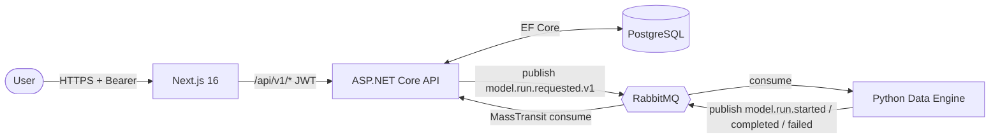

# AGENTS.md — Enterprise App

**This file is the canonical, tool-agnostic project reference for coding agents and human contributors.** Assistant-specific entry points (for example `CLAUDE.md`) should point here rather than duplicate this content. Keep changes to project conventions in this file.

## Project Overview

A Docker-first, event-driven enterprise demo application focused around a generic "model," deployable to Azure or AWS through peer Terraform roots and provider CLIs. The system demonstrates SSO, async job processing, observability, and repeatable infrastructure-as-code deployments.

The development occurs within a VS Code-based Devcontainer, as defined in `.devcontainer`. Any missing CLIs, dependencies, should be updated accordingly in setup script `.devcontainer/scripts/setup-env.sh`.

### Architecture

- **Next.js 16** (`ui/`) — App Router UI, deployed as the same standalone container on both clouds
- **ASP.NET Core .NET 10 REST API** (`api/`) — system-of-record, EF Core + Postgres, publishes commands to RabbitMQ
- **Python 3 Data Engine** (`data-engine`) - companion service for numerical computations and data-related workflows, jobs, etc.; transmits data via RabbitMQ
- **RabbitMQ** — message broker for async job workflows
- **PostgreSQL** — relational data store, managed via EF Core migrations
- **Azure Container Apps or AWS ECS/Fargate** — deployment-selected application runtime
- **Terraform** (`infra/azure`, `infra/aws`) — peer provider implementations behind common orchestration

### Interaction Flow



The API is the system of record; the data engine is a stateless worker. All cross-service communication is either (a) Bearer-authenticated HTTP (browser → API) or (b) RabbitMQ messages keyed by `model.run.*.v1` routing keys with contracts defined in `schemas/`.

## Project Repository Structure

High-level layout only — a single level of expansion per service, intentionally. Deeper structure is discoverable from the code and should not be mirrored here (it rots fast and adds no value over `ls`).

```
/workspace
├── api/                                # ASP.NET Core .NET 10 REST API
│   ├── src/
│   │   ├── EA.Api/                     # Web host: Controllers/, Auth/ handlers, Program.cs, DI wiring
│   │   ├── EA.Domain/                  # Entities/, Enums/, repository Interfaces/
│   │   ├── EA.Infrastructure/          # Data/ (DbContext, Configurations/, Interceptors/), Migrations/,
│   │   │                               #   Facades/, Repositories/, Consumers/, Messaging/, Seeding/
│   │   └── EA.Contracts/               # Shared DTOs (Models/) and RabbitMQ message records (Messages/)
│   ├── tests/
│   │   ├── EA.Api.Tests/               # NUnit unit tests
│   │   └── EA.Api.IntegrationTests/    # Testcontainers (Postgres + RabbitMQ) integration tests (NUnit)
│   ├── seed/                           # Seed data applied by the migration job
│   ├── Dockerfile                      # Multi-stage: SDK build → aspnet runtime
│   └── Dockerfile.migrations           # EF Core migration bundle image
├── ui/                                 # Next.js 16 App Router application
│   ├── app/                            # Routes, layouts, callback, runtime-config and health handlers
│   ├── components/                     # Client components and cloud-neutral OIDC adapter
│   ├── lib/                            # API client, hooks, types, formatting
│   └── Dockerfile                      # Standalone server image on canonical port 3000
├── data-engine/                        # Python 3 worker service
│   └── src/data_engine/
│       ├── consumers/                  # pika consumers keyed to routing keys
│       ├── producers/                  # pika publishers for run lifecycle events
│       ├── workflows/                  # Numerical workflows (numpy / scipy)
│       ├── models/                     # Pydantic message models
│       ├── topology.py                 # Exchange / queue / binding declarations
│       └── config.py                   # Settings loader
├── schemas/                            # JSON Schema message contracts (source of truth)
├── deploy/                             # Docker Compose local stack (compose.yaml + overrides)
├── infra/                              # Common deployment contract
│   ├── scripts/                        # Cloud-selected Terraform entry point
│   ├── azure/                          # Azure root, bootstrap, envs, and modules
│   └── aws/                            # AWS root, bootstrap, envs, and modules
├── docs/
│   ├── adrs/                           # Architecture Decision Records (numbered, immutable)
│   ├── runbooks/                       # Operational runbooks + SSO/bootstrap helper scripts
│   ├── summaries/                      # Cross-cutting architecture summaries (observability, etc.)
│   └── diagrams/                       # Exported architecture diagrams (png/svg/drawio)
├── .github/
│   ├── workflows/                      # CI and provider deployment workflows
│   └── scripts/                        # Build, migration, smoke-test, and registry helpers
├── .claude/                            # Claude Code tooling (agents/, skills/, hooks/) — see CLAUDE.md
├── .devcontainer/                      # VS Code devcontainer (setup-env.sh installs CLIs and deps)
├── AGENTS.md                           # This file — canonical agent-facing project guide
├── CLAUDE.md                           # Claude Code entry point; defers to this file
└── README.md                           # Human-facing executive overview
```

Deeper structure (individual components, feature folders, migration files, etc.) is intentionally not mirrored here — it rots fast and `ls` or each service's own `README.md` is a better source.

## Technology Stack & Versions

| Layer | Technology | Version | Notes |
|---|---|---|---|
| API runtime | .NET | 10 | `mcr.microsoft.com/dotnet/sdk:10.0` / `aspnet:10.0` |
| API framework | ASP.NET Core | 10 | Minimal APIs preferred; controllers acceptable |
| ORM | EF Core + Npgsql | latest stable | Npgsql.EntityFrameworkCore.PostgreSQL |
| Messaging (.NET) | MassTransit | latest stable | RabbitMQ transport, outbox, sagas |
| Frontend | Next.js / React | 16 / 19 | App Router, standalone server output |
| Frontend auth | oidc-client-ts | latest stable | Auth code flow + PKCE via Entra or Cognito |
| Database | PostgreSQL | 16 | Azure Flexible Server, AWS RDS, or `postgres:16` locally |
| Message broker | RabbitMQ | 4 | `rabbitmq:4-management` image |
| IaC | Terraform | ≥1.9 | AzureRM/AzureAD or AWS providers; Blob/S3 state |
| Containers | Docker | Compose v2 | Multi-stage builds, BuildKit |
| CI/CD | GitHub Actions | — | Workload identity/OIDC; immutable container tags |
| Observability | OpenTelemetry | — | Azure Monitor or OTLP/ADOT selected at runtime |

## Development Workflow

### Local Development (Docker-first)

```bash
# Start full stack
docker compose -f deploy/compose.yaml up --build

# API:         http://localhost:8000
# UI:          http://localhost:3000
# Data Engine: no inbound port
# RabbitMQ:    http://localhost:15672 (guest/guest)
# Postgres:    localhost:5432 (ea-db/postgres/password)
```

### Running Tests

```bash
# API unit tests
dotnet test api/tests/EA.Api.Tests/

# API integration tests (requires Docker for Testcontainers)
dotnet test api/tests/EA.Api.IntegrationTests/

# UI tests
cd ui && npm test
```

### Database Migrations

```bash
# Add a migration
cd api/src/EA.Infrastructure
dotnet ef migrations add <MigrationName> -s ../EA.Api

# Apply locally
dotnet ef database update -s ../EA.Api

# Generate idempotent SQL script (for CI/CD, committed as a PR review artifact)
dotnet ef migrations script --idempotent -s ../EA.Api -o Migrations/Scripts/{timestamp}_{Name}.sql
```

The generated `.sql` pairs with the C# migration of the same stem (e.g. `20260412143913_InitialCreate.sql` next to `20260412143913_InitialCreate.cs`).

## Coding Standards & Conventions

### General

- **American English throughout.** All code, comments, commit messages, documentation, and any other written text must use American English spelling and grammar (e.g., `color` not `colour`, `behavior` not `behaviour`, `initialize` not `initialise`, `serialize` not `serialise`).
- **No `// TODO` without a linked issue.** Use `// HACK:` only with justification.
- **All public APIs must have XML doc comments** (API project) or JSDoc (UI project).
- **Fail fast.** Validate inputs at boundaries; use guard clauses.
- **Prefer immutability.** Use `record` types in C# and readonly TypeScript contracts.

### C# / .NET

- Target `net10.0`. Enable nullable reference types (`<Nullable>enable</Nullable>`).
- Use file-scoped namespaces.
- Use primary constructors where appropriate.
- Use facade + repository design pattern, as called from appropriate REST API controllers.
- Follow ASP.NET Core conventions: `ProblemDetails` for errors (RFC 9457), `IResult` for minimal APIs.
- Logging: use `ILogger<T>` with structured logging (message templates, not string interpolation).
- EF Core: no lazy loading. Use explicit `.Include()` or projection queries.
- MassTransit consumers go in `EA.Infrastructure/Consumers/`.
- Migrations go in `EA.Infrastructure/Migrations/`.
- Connection strings and secrets come from configuration (environment variables in containers, Key Vault on Azure, or Secrets Manager on AWS). **Never hardcode secrets.**

### Next.js / TypeScript

- Use App Router and Server Components by default; add `'use client'` only for browser state/effects.
- HTTP calls go through `lib/api.ts`, not directly from feature pages.
- Public deployment configuration comes from `/api/runtime-config`; never expose secrets there.
- Authentication uses the cloud-neutral OIDC adapter and Authorization Code + PKCE.
- The canonical UI port is 3000 in development, containers, health checks, and documentation.
- Strict TypeScript (`strict: true`). No `any` types without justification.

### Terraform

- Use focused modules for logical service concerns under the selected provider root (see `infra/azure/modules/` and `infra/aws/modules/`). Keep provider roots composition-only.
- All resources must be tagged: `environment`, `project`, `managed-by = "terraform"`.
- Use `terraform fmt` and `terraform validate` before committing.
- Variables must have `description` and `type`. Use `sensitive = true` for secrets.
- Keep Azure and AWS state separate in Blob Storage and S3 respectively.
- Prefer managed/workload identities and IAM roles over passwords/keys everywhere.

### Docker

- All Dockerfiles use multi-stage builds.
- Copy dependency manifests first for layer caching (`*.csproj`, `package*.json`).
- Run as non-root user in production images.
- Pin base image versions (e.g., `dotnet/aspnet:10.0`, not `latest`).
- Use `.dockerignore` to exclude `bin/`, `obj/`, `node_modules/`, `.git/`.

### Messaging Contracts

- Message types live in `schemas/` as JSON Schema (Draft 2020-12).
- Routing keys are versioned: `analysis.job.requested.v1`.
- All messages must include: `messageId` (uuid), `correlationId` (uuid), `occurredAtUtc` (ISO 8601).
- Use the outbox pattern (MassTransit) for transactional consistency between DB writes and message publishing.

## API Design

- Resource-oriented URIs: `/api/v1/{resource}`.
- URL-path versioning (`/api/v1/...`).
- Consistent error responses using ProblemDetails.
- OpenAPI document generated via Scalar; keep it in sync.
- Health endpoints: `/health/live`, `/health/ready`, `/health/startup`.

## Observability

- OpenTelemetry instrumentation with runtime-selected `azuremonitor`, `otlp`, or `none` exporters.
- Structured logs to stdout/stderr; the deployment routes them to Log Analytics or CloudWatch.
- Correlation IDs propagated across HTTP and RabbitMQ boundaries.
- Health probes wired to Container Apps or ECS/ALB health checks.
- Audit logging via `AuditStampingInterceptor` uses normalized OIDC subject, tenant/issuer, and identity-provider values.

## Deployment Pipeline

### CI (`ci.yml`)
- **Every push/PR** → API/UI tests, both Terraform roots and bootstraps, shell adapters, and all four portable container builds.
- **Pull requests and `main`** → integration tests (Testcontainers) after unit tests pass.

### Deploy (`deploy.yml`)
1. **Require an explicit target** → manual runs select `azure`, `aws`, or `both`; push runs require the repository variable `DEPLOYMENT_TARGETS` with one of those values. There is no default provider.
2. **Detect changes once** → `git diff` identifies changes under `api/`, `data-engine/`, and `ui/`.
3. **Call provider adapters** → reusable `deploy-azure.yml` and `deploy-aws.yml` workflows run only for selected targets and use protected logical `dev` / `production` GitHub Environments so customer identity-provider registrations are reused across cloud targets.
4. **Apply registry phase** → create the selected provider registry before image publication.
5. **Build or copy immutable images** → publish the same four images to ACR or ECR.
6. **Apply full stack, migrate, and smoke test** → use the provider-native one-off migration workload, then poll the normalized `api_url` output.

### Image tagging
- `main` → `sha-<sha7>`
- Non-main → `<branch-slug>-<sha7>`

### Image retention (`cleanup-images.yml`)
- Manual maintenance explicitly selects Azure, AWS, or both. Provider adapters enforce the same keep-newest policy; ECR also has Terraform-managed lifecycle policies.

## Cloud Resource Mapping

| Component | Azure | AWS |
|---|---|---|
| API/UI/worker | Container Apps | ECS/Fargate |
| RabbitMQ | Container App | ECS/Fargate + EFS |
| Migrations | Container Apps Job | ECS one-off task |
| Database | PostgreSQL Flexible Server | RDS PostgreSQL |
| Images | ACR | ECR |
| Secrets | Key Vault | Secrets Manager |
| Customer SSO | Entra External ID | Cognito |
| Logs/APM | Log Analytics + Application Insights | CloudWatch + X-Ray/ADOT |

## Assistant-Specific Tooling

Conventions above apply to every agent working in this repository. Tooling that only exists for a particular assistant is documented in that assistant's own entry point:

| Assistant | Entry point | Contains |
|---|---|---|
| Claude Code | [`CLAUDE.md`](./CLAUDE.md) | Specialized subagents (`.claude/agents/`), workflow skills (`.claude/skills/`), hooks |

When adding a new assistant, create its entry point file, have it defer to this document, and add a row here.
