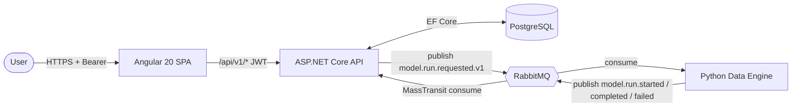

# CLAUDE.md — Enterprise App

## Project Overview

A Docker-first, event-driven enterprise demo application focused around a generic "model," deployed to Azure via Terraform (and respective CLIs). The system demonstrates enterprise patterns: SSO, async job processing, observability, and repeatable IaC deployments.

The development occurs within a VS Code-based Devcontainer, as defined in `.devcontainer`. Any missing CLIs, dependencies, should be updated accordingly in setup script `.devcontainer/scripts/setup-env.sh`.

### Architecture

- **Angular 20 SPA** (`ui/`) — client UI, hosted on Azure Static Web Apps
- **ASP.NET Core .NET 10 REST API** (`api/`) — system-of-record, EF Core + Postgres, publishes commands to RabbitMQ
- **Python 3 Data Engine** (`data-engine`) - companion service for numerical computations and data-related workflows, jobs, etc.; transmits data via RabbitMQ
- **RabbitMQ** — message broker for async job workflows
- **PostgreSQL** — relational data store, managed via EF Core migrations
- **Azure Container Apps** — runtime for API and RabbitMQ containers
- **Terraform** (`infra/`) — all Azure infrastructure as code

### Interaction Flow



The API is the system of record; the data engine is a stateless worker. All cross-service communication is either (a) Bearer-authenticated HTTP (browser → API) or (b) RabbitMQ messages keyed by `model.run.*.v1` routing keys with contracts defined in `schemas/`.

## Project Repository Structure

High-level layout only — a single level of expansion per service, intentionally. Deeper structure is discoverable from the code and should not be mirrored here (it rots fast and adds no value over `ls`).

```
/workspace
├── api/                                # ASP.NET Core .NET 10 REST API
│   ├── src/
│   │   ├── EA.Api/                     # Web host: Controllers/, Auth/ handlers, Program.cs, DI wiring
│   │   ├── EA.Domain/                  # Entities/, Enums/, repository Interfaces/
│   │   ├── EA.Infrastructure/          # Data/ (DbContext, Configurations/, Interceptors/), Migrations/,
│   │   │                               #   Facades/, Repositories/, Consumers/, Messaging/, Seeding/
│   │   └── EA.Contracts/               # Shared DTOs (Models/) and RabbitMQ message records (Messages/)
│   ├── tests/
│   │   ├── EA.Api.Tests/               # NUnit unit tests
│   │   └── EA.Api.IntegrationTests/    # Testcontainers (Postgres + RabbitMQ) integration tests (NUnit)
│   ├── seed/                           # Seed data applied by the migration job
│   ├── Dockerfile                      # Multi-stage: SDK build → aspnet runtime
│   └── Dockerfile.migrations           # EF Core migration bundle image
├── ui/                                 # Angular 20 SPA
│   ├── src/app/
│   │   ├── auth/                       # MSAL config, AuthService, BearerAuthInterceptor, guards
│   │   ├── core/                       # App-wide services (UiStateService, theme, App Insights, HTTP)
│   │   ├── features/                   # Feature routes (dashboard, landing, models, runs)
│   │   ├── shared/                     # Reusable components/ and shared model interfaces
│   │   └── environments/               # Build-time environment shims
│   ├── e2e/                            # Playwright end-to-end tests
│   ├── scripts/                        # generate-environment.mjs (runtime env injection)
│   └── nginx.conf                      # Local prod-parity container only; SWA in cloud
├── data-engine/                        # Python 3 worker service
│   └── src/data_engine/
│       ├── consumers/                  # pika consumers keyed to routing keys
│       ├── producers/                  # pika publishers for run lifecycle events
│       ├── workflows/                  # Numerical workflows (numpy / scipy)
│       ├── models/                     # Pydantic message models
│       ├── topology.py                 # Exchange / queue / binding declarations
│       └── config.py                   # Settings loader
├── schemas/                            # JSON Schema message contracts (source of truth)
├── deploy/                             # Docker Compose local stack (compose.yaml + overrides)
├── infra/                              # Terraform
│   ├── bootstrap/                      # One-time bootstrap stack (remote state backend, root RG, ACR)
│   ├── envs/                           # Per-environment tfvars (dev.tfvars, production.tfvars)
│   ├── modules/                        # container-apps, postgres, static-web-app, container-registry,
│   │                                   #   key-vault, observability, diagnostics, entra-external-id
│   ├── main.tf                         # Root stack (top-level *.tf files)
│   ├── variables.tf
│   ├── outputs.tf
│   ├── locals.tf
│   └── versions.tf
├── docs/
│   ├── adrs/                           # Architecture Decision Records (numbered, immutable)
│   ├── runbooks/                       # Operational runbooks + SSO/bootstrap helper scripts
│   ├── summaries/                      # Cross-cutting architecture summaries (observability, etc.)
│   └── diagrams/                       # Exported architecture diagrams (png/svg/drawio)
├── .github/
│   ├── workflows/                      # ci.yml, deploy.yml, cleanup-acr.yml
│   └── scripts/                        # CI helpers (build-and-push-images.sh, build-ui.sh,
│                                       #   run-migrations-job.sh, smoke-test.sh, clean-acr-images.sh, ...)
├── .devcontainer/                      # VS Code devcontainer (setup-env.sh installs CLIs and deps)
├── CLAUDE.md                           # This file — agent-facing project guide
└── README.md                           # Human-facing executive overview
```

Deeper structure (individual components, feature folders, migration files, etc.) is intentionally not mirrored here — it rots fast and `ls` or each service's own `README.md` is a better source.

## Technology Stack & Versions

| Layer | Technology | Version | Notes |
|---|---|---|---|
| API runtime | .NET | 10 | `mcr.microsoft.com/dotnet/sdk:10.0` / `aspnet:10.0` |
| API framework | ASP.NET Core | 10 | Minimal APIs preferred; controllers acceptable |
| ORM | EF Core + Npgsql | latest stable | Npgsql.EntityFrameworkCore.PostgreSQL |
| Messaging (.NET) | MassTransit | latest stable | RabbitMQ transport, outbox, sagas |
| Frontend | Angular | 20 | Standalone components, signals preferred |
| Frontend auth | MSAL Angular | latest | Auth code flow + PKCE via Entra ID |
| Database | PostgreSQL | 16 | Azure Flexible Server in cloud; `postgres:16` locally |
| Message broker | RabbitMQ | 4 | `rabbitmq:4-management` image |
| IaC | Terraform | ≥1.9 | AzureRM provider, azurerm backend |
| Containers | Docker | Compose v2 | Multi-stage builds, BuildKit |
| CI/CD | GitHub Actions | — | OIDC to Azure, selective image builds, ACR cleanup |
| Observability | OpenTelemetry | — | Azure Monitor distro for .NET |

## Development Workflow

### Local Development (Docker-first)

```bash
# Start full stack
docker compose -f deploy/compose.yaml up --build

# API:         http://localhost:8000
# UI:          http://localhost:4200
# Data Engine: http://localhost:5000
# RabbitMQ:    http://localhost:15672 (guest/guest)
# Postgres:    localhost:5432 (ea-db/postgres/password)
```

### Running Tests

```bash
# API unit tests
dotnet test api/tests/EA.Api.Tests/

# API integration tests (requires Docker for Testcontainers)
dotnet test api/tests/EA.Api.IntegrationTests/

# UI tests
cd ui && npm test
```

### Database Migrations

```bash
# Add a migration
cd api/src/EA.Infrastructure
dotnet ef migrations add <MigrationName> -s ../EA.Api

# Apply locally
dotnet ef database update -s ../EA.Api

# Generate idempotent SQL script (for CI/CD, committed as a PR review artifact)
dotnet ef migrations script --idempotent -s ../EA.Api -o Migrations/Scripts/{timestamp}_{Name}.sql
```

The generated `.sql` pairs with the C# migration of the same stem (e.g. `20260412143913_InitialCreate.sql` next to `20260412143913_InitialCreate.cs`).

## Coding Standards & Conventions

### General

- **American English throughout.** All code, comments, commit messages, documentation, and any other written text must use American English spelling and grammar (e.g., `color` not `colour`, `behavior` not `behaviour`, `initialize` not `initialise`, `serialize` not `serialise`).
- **No `// TODO` without a linked issue.** Use `// HACK:` only with justification.
- **All public APIs must have XML doc comments** (API project) or JSDoc (UI project).
- **Fail fast.** Validate inputs at boundaries; use guard clauses.
- **Prefer immutability.** Use `record` types in C#, `readonly` signals in Angular.

### C# / .NET

- Target `net10.0`. Enable nullable reference types (`<Nullable>enable</Nullable>`).
- Use file-scoped namespaces.
- Use primary constructors where appropriate.
- Use facade + repository design pattern, as called from appropriate REST API controllers.
- Follow ASP.NET Core conventions: `ProblemDetails` for errors (RFC 9457), `IResult` for minimal APIs.
- Logging: use `ILogger<T>` with structured logging (message templates, not string interpolation).
- EF Core: no lazy loading. Use explicit `.Include()` or projection queries.
- MassTransit consumers go in `EA.Infrastructure/Consumers/`.
- Migrations go in `EA.Infrastructure/Migrations/`.
- Connection strings and secrets come from configuration (environment variables in containers, Key Vault in Azure). **Never hardcode secrets.**

### Angular / TypeScript

- Use standalone components (no NgModules for feature components).
- Use Angular signals for local state; NgRx SignalStore for shared state.
- Use `inject()` function over constructor injection.
- HTTP calls go through dedicated service classes in `core/services/`.
- Use `environment.ts` for configuration; MSAL config in `auth/`.
- Strict TypeScript (`strict: true`). No `any` types without justification.

### Terraform

- Use modules for logical resource groups (see `infra/modules/`).
- All resources must be tagged: `environment`, `project`, `managed-by = "terraform"`.
- Use `terraform fmt` and `terraform validate` before committing.
- Variables must have `description` and `type`. Use `sensitive = true` for secrets.
- Remote state in Azure Blob Storage with locking.
- Prefer managed identities over passwords/keys everywhere.

### Docker

- All Dockerfiles use multi-stage builds.
- Copy dependency manifests first for layer caching (`*.csproj`, `package*.json`).
- Run as non-root user in production images.
- Pin base image versions (e.g., `dotnet/aspnet:10.0`, not `latest`).
- Use `.dockerignore` to exclude `bin/`, `obj/`, `node_modules/`, `.git/`.

### Messaging Contracts

- Message types live in `schemas/` as JSON Schema (Draft 2020-12).
- Routing keys are versioned: `analysis.job.requested.v1`.
- All messages must include: `messageId` (uuid), `correlationId` (uuid), `occurredAtUtc` (ISO 8601).
- Use the outbox pattern (MassTransit) for transactional consistency between DB writes and message publishing.

## API Design

- Resource-oriented URIs: `/api/v1/{resource}`.
- URL-path versioning (`/api/v1/...`).
- Consistent error responses using ProblemDetails.
- OpenAPI document generated via Scalar; keep it in sync.
- Health endpoints: `/health/live`, `/health/ready`, `/health/startup`.

## Observability

- OpenTelemetry SDK with Azure Monitor distro (`Azure.Monitor.OpenTelemetry.AspNetCore`).
- Structured logs to stdout/stderr (Container Apps routes to Log Analytics).
- Correlation IDs propagated across HTTP and RabbitMQ boundaries.
- Health probes wired to Container Apps liveness/readiness/startup checks.
- Audit logging via `AuditStampingInterceptor` on every `SaveChanges` call. Emits rows to the `audit_events` table for domain mutations (`model.created`, `model.updated`, `model.archived`, `modelrun.requested`) with actor identity from the authenticated user's Entra ID claims.

## Deployment Pipeline

### CI (`ci.yml`)
- **Every push** → unit tests (API + UI) run on all branches.
- **Merge to `main`** → integration tests (Testcontainers) run after unit tests pass.

### Deploy (`deploy.yml`)
1. **Detect changes** → `git diff` identifies which sub-apps changed (`api/`, `data-engine/`).
2. **Terraform apply — phase 1** → ensures resource group + ACR exist.
3. **Selective image builds** → only changed images are rebuilt via `az acr build`; unchanged images are re-tagged to the new `IMAGE_TAG` via `az acr import`.
4. **Terraform apply — phase 2** → full infrastructure apply with the new image tag.
5. **Migration job** → Container Apps Job runs EF Core migration bundle.
6. **SWA deploy** → Angular build deployed to Static Web Apps.
7. **Smoke test** → `GET /health/ready` with retries.

### Image tagging
- `main` → `sha-<sha7>`
- Non-main → `<branch-slug>-<sha7>`

### ACR cleanup (`cleanup-acr.yml`)
- **On merge to `main`** → prunes stale image tags from both dev and production ACRs, keeping only the most recent tag per repository.

## Azure Resource Mapping

| Component | Azure Service | Terraform Resource |
|---|---|---|
| API | Container Apps | `azurerm_container_app` |
| RabbitMQ | Container Apps | `azurerm_container_app` |
| Migrations | Container Apps Jobs | `azurerm_container_app_job` |
| UI | Static Web Apps | `azurerm_static_web_app` |
| Database | PostgreSQL Flexible Server | `azurerm_postgresql_flexible_server` |
| Images | Container Registry | `azurerm_container_registry` |
| Secrets | Key Vault | `azurerm_key_vault` |
| Logs | Log Analytics | `azurerm_log_analytics_workspace` |
| APM | Application Insights | `azurerm_application_insights` |

## Agents

Specialized agents are available in `.claude/agents/` for focused work:

| Agent | File | Scope |
|---|---|---|
| Documentation | `docs.md` | Architecture docs, ADRs, runbooks, README updates |
| Testing | `testing.md` | Unit, integration, contract, and E2E tests |
| Frontend | `frontend.md` | Angular UI components, services, routing, auth |
| Backend | `backend.md` | ASP.NET Core API, EF Core, MassTransit, domain logic |
| Data Engine | `data-engine.md` | Python data engine, RabbitMQ consumers/producers, computation workflows |
| Database | `database.md` | EF Core migrations, schema design, query optimization |
| Infrastructure | `infrastructure.md` | Terraform, Docker, Compose, CI/CD workflows |
| Review | `review.md` | Code review, PR feedback, standards enforcement |

## Skills

Reusable workflow skills are available in `.claude/skills/` for focused scaffolding:

| Skill | Folder | Scope |
|---|---|---|
| Add EF Migration | `add-ef-migration/` | New EF Core migration with review artifacts |
| Add Integration Test | `add-integration-test/` | Testcontainers-based integration test for an endpoint or consumer |
| Add Message Contract | `add-message-contract/` | RabbitMQ message schema, .NET record, and MassTransit consumer |
| Add GitHub Workflow | `add-github-workflow/` | New GitHub Actions CI/CD workflow |
| Add Docker Service | `add-docker-service/` | New service in Docker Compose |
| Add Terraform Module | `add-terraform-module/` | New Terraform module for an Azure resource concern |
| Scaffold API Endpoint | `scaffold-api-endpoint/` | New REST endpoint with domain entity, EF config, DTOs, and migration |
| Scaffold Angular Feature | `scaffold-angular-feature/` | New Angular feature with component, service, and route |
| Scaffold Data Engine Worker | `scaffold-data-engine-worker/` | New Python RabbitMQ consumer, Pydantic model, workflow, and test stubs |
