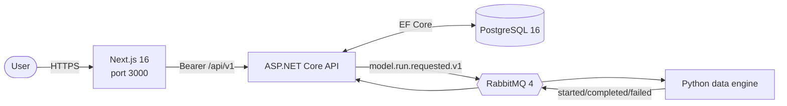

# Enterprise App

A Docker-first, event-driven reference application with a Next.js 16 UI, .NET 10 API, Python data engine, PostgreSQL, and RabbitMQ. Azure and AWS are peer deployment targets selected at deployment time; application services use normalized OIDC and OpenTelemetry contracts rather than cloud SDK types.

## Architecture



The API is the system of record and the worker is stateless. JSON Schemas under `schemas/` define versioned message contracts. The same four application images (`ea-ui`, `ea-api`, `ea-data-engine`, and `ea-migrations`) are deployed to either cloud.

| Capability | Azure | AWS |
|---|---|---|
| UI/API/worker | Azure Container Apps | ECS on Fargate behind an ALB |
| Migration | Container Apps Job | ECS one-off task |
| PostgreSQL | Flexible Server | RDS PostgreSQL |
| Images | ACR | ECR |
| Secrets | Key Vault | Secrets Manager |
| SSO | Entra External ID | Cognito user pools |
| Telemetry | Azure Monitor adapter | OTLP to ADOT, CloudWatch, and X-Ray |
| State | Azure Blob | S3 native state locking |

## Local development

```bash
docker compose -f deploy/compose.yaml up --build
```

| Service | URL |
|---|---|
| Next.js UI | http://localhost:3000 |
| API / Scalar | http://localhost:8000 / http://localhost:8000/scalar/v1 |
| RabbitMQ management | http://localhost:15672 (`guest` / `guest`) |
| PostgreSQL | localhost:5432 (`postgres` / `password`) |

Run individual checks with:

```bash
dotnet test api/EA.sln
(cd data-engine && pytest)
(cd ui && npm ci && npm run lint && npm test && npm run build)
infra/scripts/deploy.sh validate azure
infra/scripts/deploy.sh validate aws
```

## Authentication contract

The browser uses `oidc-client-ts` with Authorization Code + PKCE. `/api/runtime-config` reads deployment-time `AUTH_PROVIDER`, `AUTH_AUTHORITY`, `AUTH_CLIENT_ID`, and `AUTH_API_SCOPE` values. Terraform selects `entra` on Azure or `cognito` on AWS. The API consumes the matching normalized `Authentication:*` section and maps provider claims into stable subject, tenant/issuer, identity-provider, name, and email values.

Synthetic development and guest sessions remain explicit opt-ins. They are convenient for local/demo workflows and must not be treated as production SSO.

## Infrastructure and operations

- [`infra/README.md`](./infra/README.md) defines the shared deployment contract and CLI.
- [`infra/azure/`](./infra/azure/) and [`infra/aws/`](./infra/aws/) contain peer provider roots, modules, environment values, and bootstraps.
- The [AWS deployment workbook](./docs/workbooks/aws-deployment-workbook.md) records account prerequisites, CLI steps, SSO parity, evidence, rollback, and production gates.
- [ADR 0002](./docs/adrs/0002-aws-peer-architecture.md) defines the AWS mapping; [ADR 0003](./docs/adrs/0003-multicloud-application-generalization.md) defines the cross-cloud application boundary.

The AWS configuration is an accountless prototype: local provider-schema validation passes, but an account-backed plan/apply and all workbook readiness gates remain required before production use.

GitHub Actions uses [deploy.yml](./.github/workflows/deploy.yml) as its cloud-neutral entry point. Manual runs choose `azure`, `aws`, or `both`; automatic push deployments require the repository variable `DEPLOYMENT_TARGETS` to make that choice explicitly. Provider credentials and approvals live in `azure-dev`, `azure-production`, `aws-dev`, and `aws-production` GitHub Environments.

## Repository guides

| Area | Guide |
|---|---|
| Contributor/agent conventions | [`AGENTS.md`](./AGENTS.md) |
| UI | [`ui/README.md`](./ui/README.md) |
| API | [`api/README.md`](./api/README.md) |
| Data engine | [`data-engine/README.md`](./data-engine/README.md) |
| Local Compose | [`deploy/README.md`](./deploy/README.md) |
| Documentation index | [`docs/README.md`](./docs/README.md) |
