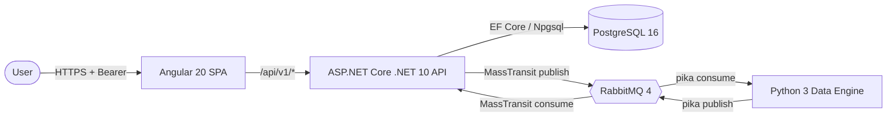
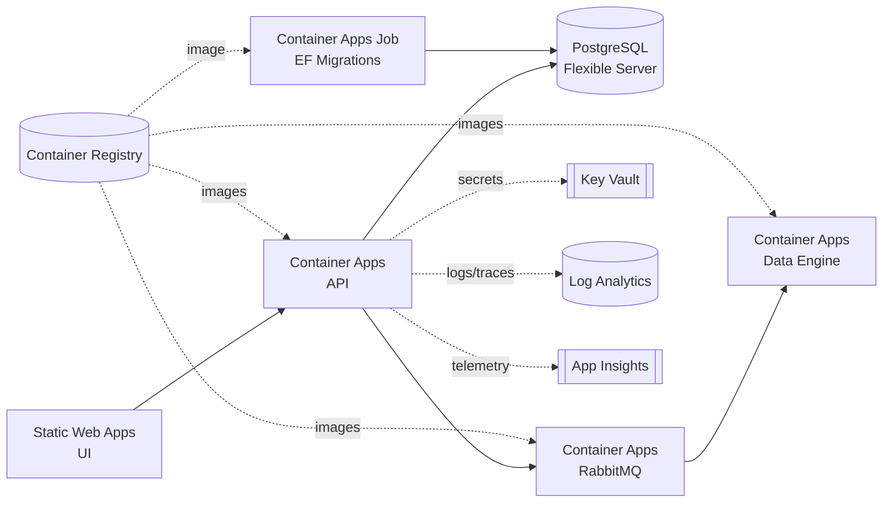
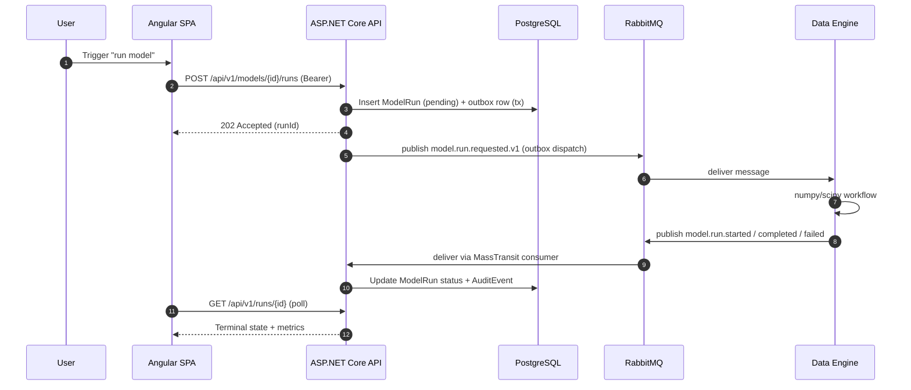
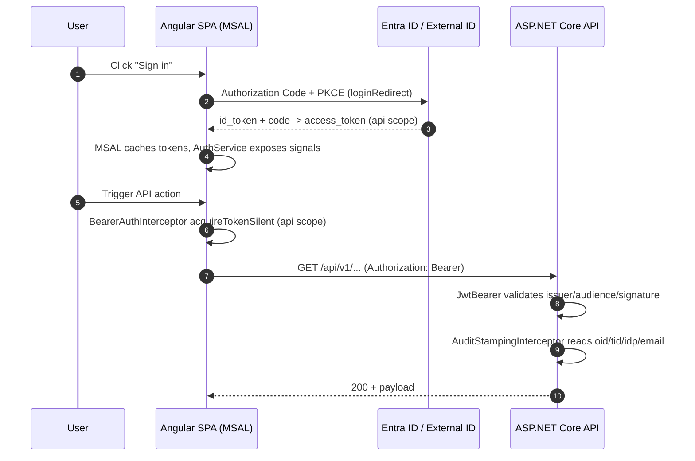

# Enterprise App

A Docker-first, event-driven enterprise demo application organised around a generic "model" domain. The system showcases enterprise-grade patterns end to end: SSO with Microsoft Entra ID, async job processing over RabbitMQ, first-class observability, EF Core migrations, and a repeatable Terraform-driven deployment to Azure Container Apps and Static Web Apps.

See [`CLAUDE.md`](./CLAUDE.md) for the authoritative stack versions, conventions, and deployment pipeline reference.

## Service Topology

## Azure Target Mapping

## Model-Run Sequence

## Authentication

The platform uses **Microsoft Entra ID** for sign-in. Both workforce tenants (standard Entra ID) and customer-facing CIAM (Entra External ID) are supported — the API validates tokens by issuer/audience configured under the `AzureAd` section, so either flavor of tenant is a pure configuration change. MSAL Angular drives the browser side; `Microsoft.Identity.Web` drives the API side.

### Sign-in and API call flow

### Frontend (Angular + MSAL)

- MSAL Angular v3 with `PublicClientApplication`, `InteractionType.Redirect`, Authorization Code + PKCE.
- MSAL config lives in `ui/src/app/auth/msal.config.ts`; `AuthService` (`ui/src/app/auth/auth.service.ts`) projects MSAL state into Angular signals (`isAuthenticated`, `activeAccount`, `displayName`, `idp`).
- `BearerAuthInterceptor` (`ui/src/app/auth/bearer-auth.interceptor.ts`) attaches an access token via `acquireTokenSilent` for the configured `aadApiScope` on requests to `${apiUrl}/api/`; other URLs pass through untouched. On `InteractionRequiredAuthError` it falls back to `acquireTokenRedirect`.
- Route protection is handled by `AuthGuard` / `MsalGuard` at the router layer.

### Backend (ASP.NET Core + Microsoft.Identity.Web)

- Bearer validation via `AddMicrosoftIdentityWebApi` bound to the `AzureAd` config section (see `api/src/EA.Api/Program.cs`). Issuer, audience, and signing keys are validated; `NameClaimType` is set to `name`.
- Authorization is **require-authenticated-user** globally: every controller carries `[Authorize]` (`ModelsController`, `RunsController`, `AuditEventsController`), and both `DefaultPolicy` and `FallbackPolicy` require an authenticated principal. Health endpoints (`/health/*`) are `AllowAnonymous`. No per-scope or per-role gating is applied today — add `RequireScope(...)` / `RequireRole(...)` when granular authorization is needed.
- Entra External ID tenants are configured by pointing `AzureAd:Authority` at the External ID issuer; no code change is required.

### Dev and demo auth (non-production)

Two demonstration-user-oriented synthetic-principal handlers let environments bypass Entra without weakening production:

| Handler | Scheme | Gate flag | Trigger | Intended use |
|---|---|---|---|---|
| `DevAuthHandler` | `Dev` | `AzureAd:Enabled=false` **or** `AzureAd:AllowDev=true` | No `Authorization` header | `docker compose` local stack, Playwright E2E ("Log in as Dev"), curl, integration tests |
| `GuestAuthHandler` | `Guest` | `AzureAd:AllowGuest=true` | No `Authorization` header | Production sales/demo "Log in as Guest" affordance |

When `AllowDev` or `AllowGuest` is on alongside real Entra, a **policy scheme** (`JwtOrDev` / `JwtOrGuest`) is registered as the default: requests with `Authorization: Bearer ...` forward to `JwtBearer`, everything else forwards to the dev/guest handler. Both flags must be **false in production** (except the explicit guest-demo case). Handlers live in `api/src/EA.Api/Auth/`.

### Audit identity

`AuditStampingInterceptor` reads `oid`, `tid`, `idp`, `name`, and email from the authenticated principal (via the request-scoped `ICurrentUser`) and stamps them onto `audit_events` rows and onto outbound RabbitMQ messages via `UserContextPublishFilter<T>` (headers `x-user-oid`, `x-user-tid`, `x-user-idp`, `x-user-name`, `x-user-email`). See `CLAUDE.md › Observability` for the audited event list.

## Services

| Service | Path | Tech | Responsibility | Azure Target |
|---|---|---|---|---|
| UI | `ui/` | Angular 20, MSAL, Material, App Insights JS | SPA; Entra auth; model CRUD + run visualisation | Static Web Apps |
| API | `api/` | ASP.NET Core .NET 10, EF Core, MassTransit | System of record; command origination; audit | Container Apps |
| Data Engine | `data-engine/` | Python 3.11+, pika, Pydantic, numpy, scipy | Async numerical workflows driven by messages | Container Apps |
| Broker | — | RabbitMQ 4 (management image) | Transport for `model.run.*` routing keys | Container Apps |
| Database | — | PostgreSQL 16 | Relational store; EF Core migrations | PostgreSQL Flexible Server |
| Migrations | `api/Dockerfile.migrations` | EF Core bundle | Idempotent schema apply on deploy | Container Apps Job |

## CI/CD and Azure Mapping

| Pipeline stage (see `.github/workflows/`) | Actor | Azure surface touched | Terraform module(s) |
|---|---|---|---|
| `ci.yml` — unit tests (every push) | GitHub Actions | none | — |
| `ci.yml` — integration tests (PRs, main) | Testcontainers on runner | none | — |
| `deploy.yml` phase 1 — bootstrap | `terraform apply` | Resource Group, ACR | `container-registry/` |
| `deploy.yml` — selective build | `az acr build` / `az acr import` | Container Registry | `container-registry/` |
| `deploy.yml` phase 2 — full apply | `terraform apply` | Container Apps, PG, KV, Obs, SWA, Entra External ID | `container-apps/`, `postgres/`, `key-vault/`, `observability/`, `static-web-app/`, `entra-external-id/`, `diagnostics/` |
| `deploy.yml` — migrations | Container Apps Job | PostgreSQL Flexible Server | `postgres/` |
| `deploy.yml` — SWA publish | SWA deploy action | Static Web Apps | `static-web-app/` |
| `deploy.yml` — smoke | `curl /health/ready` | Container Apps | — |
| `cleanup-acr.yml` (on merge to main) | `az acr repository` | Container Registry | — |

Image tags: `sha-<sha7>` on `main`, `<branch-slug>-<sha7>` elsewhere.

## Getting Started

- **Local full stack** — see [`deploy/README.md`](./deploy/README.md). One command (`docker compose -f deploy/compose.yaml up --build`) brings up UI, API, data-engine, Postgres, and RabbitMQ.
- **Cloud deployment** — see `infra/` for the Terraform root and modules. Deployment is CI-driven via `.github/workflows/deploy.yml`.
- **Devcontainer** — the VS Code devcontainer in `.devcontainer/` provisions all CLIs (dotnet, node, python, terraform, az). Missing tools should be added to `.devcontainer/scripts/setup-env.sh`.

## Subproject READMEs

| Area | README |
|---|---|
| API (ASP.NET Core) | [`api/README.md`](./api/README.md) |
| UI (Angular) | [`ui/README.md`](./ui/README.md) |
| Data Engine (Python) | [`data-engine/README.md`](./data-engine/README.md) |
| Local Stack (Compose) | [`deploy/README.md`](./deploy/README.md) |
| Documentation Index | [`docs/README.md`](./docs/README.md) |

## Repository Layout

See `CLAUDE.md` for the canonical tree. Top-level folders: `api/`, `ui/`, `data-engine/`, `infra/`, `deploy/`, `schemas/` (JSON Schema message contracts, Draft 2020-12), `docs/`, and `.github/`.
