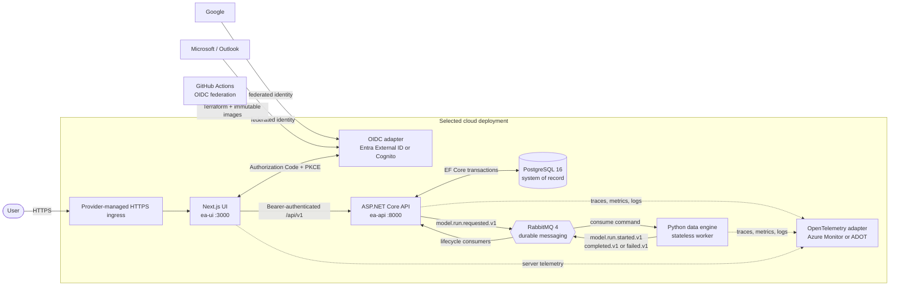

# Enterprise App

An event-driven model-management application built as four portable containers: a Next.js 16 UI, an ASP.NET Core .NET 10 API, a Python data engine, and an EF Core migration workload. PostgreSQL is the system of record, RabbitMQ carries asynchronous run commands and lifecycle events, and the same application artifacts deploy to Azure or AWS through peer Terraform implementations.

The project demonstrates the full operational path around a compact CRUD domain: federated SSO, authenticated API access, asynchronous messaging, numerical background work, audit attribution, health probes, OpenTelemetry, infrastructure as code, and push-driven delivery.

## Architecture



The API owns persistence and auditing. Requesting a run persists the `ModelRun` before publishing its command. The data engine consumes that command, performs the numerical workflow without direct database access, and publishes lifecycle events that the API reconciles into PostgreSQL with order-safe status updates. JSON Schemas under [`schemas/`](./schemas/) are the cross-language contract source of truth.

The inline diagram is mirrored in [`docs/diagrams/application-architecture.mmd`](./docs/diagrams/application-architecture.mmd) for diagram tooling and review.

## Deployment adapters

Application code depends on normalized OIDC, OpenTelemetry, configuration, and messaging contracts. Provider-specific resource behavior stays in its Terraform root.

| Capability | Azure adapter | AWS adapter |
|---|---|---|
| HTTPS application entry point | Container Apps generated HTTPS origins | CloudFront generated HTTPS origin |
| UI, API, worker, broker | Azure Container Apps | ECS on Fargate |
| Migration workload | Container Apps Job | ECS one-off task |
| PostgreSQL | Flexible Server | RDS for PostgreSQL |
| Container images | Azure Container Registry | Elastic Container Registry |
| Secrets | Key Vault | Secrets Manager |
| Customer identity | Entra External ID | Cognito user pool |
| Telemetry backend | Application Insights and Log Analytics | ADOT, CloudWatch, and X-Ray |
| Terraform state | Azure Blob Storage | Amazon S3 with native locking |

Neither cloud is the default. Terraform state, credentials, modules, and failure domains remain separate under [`infra/azure/`](./infra/azure/) and [`infra/aws/`](./infra/aws/); [`infra/scripts/deploy.sh`](./infra/scripts/deploy.sh) exposes their shared command contract.

## Local development

### Inside `ea-dev-env`

The devcontainer intentionally has no Docker daemon and must not use Docker-in-Docker. PostgreSQL and RabbitMQ are supplied by the enclosing development environment. Open three terminals and run:

```bash
run-api
run-data-engine
run-ui
```

All three processes are required for a complete model-run lifecycle. The UI is available at `http://localhost:3000`, the API at `http://localhost:8000`, and Scalar at `http://localhost:8000/scalar/v1`.

Each alias uses the tracked local-service runner and writes timestamped output plus start/exit metadata under ignored `__logs/local/`; `<service>-latest.log` always points to the newest session for that service.

The aliases are installed in `/root/.bash_aliases` by [`.devcontainer/scripts/setup-env.sh`](./.devcontainer/scripts/setup-env.sh). After setup, open a new terminal or reload them in the current terminal:

```bash
source /root/.bash_aliases
```

The aliases invoke [`.devcontainer/scripts/run-local-service.sh`](./.devcontainer/scripts/run-local-service.sh). For normal development, use the aliases. The equivalent direct invocations are:

```bash
.devcontainer/scripts/run-local-service.sh api
.devcontainer/scripts/run-local-service.sh data-engine
.devcontainer/scripts/run-local-service.sh ui
```

The runner accepts exactly one of `api`, `data-engine`, or `ui`. It records the UTC start time, process ID, Git revision, working directory, command, application output, received termination signal, and exit code. Each session has a timestamped log and a stable link to its newest log:

```bash
tail -f __logs/local/api-latest.log
tail -f __logs/local/data-engine-latest.log
tail -f __logs/local/ui-latest.log
ls -lt __logs/local/
```

An exit code of `0` is a clean shutdown, `130` normally means Ctrl+C, and `143` normally means termination. Diagnose any other nonzero code from the preceding output in the same log. A start entry without an exit entry means the runner or its terminal was killed before shutdown could be recorded. Logs remain local under ignored `__logs/`; never copy a populated runtime log into a tracked path.

To restart a service, stop it with Ctrl+C in its terminal, confirm the exit entry in its latest log, and rerun its alias. Verify the application after all three services start:

```bash
curl --fail http://localhost:8000/health/live
curl --fail http://localhost:8000/health/ready
curl --fail http://localhost:3000/api/health
```

If an alias is missing or dependencies are stale, rerun the idempotent environment setup and reload the aliases:

```bash
bash .devcontainer/scripts/setup-env.sh
source /root/.bash_aliases
```

The setup installs repository dependencies, `rg`, Google Cloud CLI, and the aliases. AWS, Azure, Google Cloud, and GitHub authentication remain explicit user sessions; the runner does not store credentials.

### On a Docker-capable host

The host-only Compose workflow starts the same services together:

```bash
docker compose -f deploy/compose.yaml up --build
```

See [`deploy/README.md`](./deploy/README.md) for ports, local credentials, volumes, and reset behavior.

## Verification

Run the suites independently so the devcontainer does not attempt Docker-backed Testcontainers tests:

```bash
# API unit tests
dotnet test api/tests/EA.Api.Tests/

# Data-engine tests and static checks
(cd data-engine && .venv/bin/pytest && .venv/bin/ruff check src tests && .venv/bin/pyright)

# UI lint, unit tests, and production build
(cd ui && npm run lint && npm test && npm run build)

# Both Terraform roots and their bootstraps
infra/scripts/deploy.sh validate azure dev
infra/scripts/deploy.sh validate aws dev
terraform -chdir=infra/azure/bootstrap init -backend=false
terraform -chdir=infra/azure/bootstrap validate
terraform -chdir=infra/aws/bootstrap init -backend=false
terraform -chdir=infra/aws/bootstrap validate
```

API integration tests use Testcontainers and therefore run on a Docker-capable host or in GitHub Actions:

```bash
dotnet test api/tests/EA.Api.IntegrationTests/
```

## Authentication contract

The browser uses `oidc-client-ts` with Authorization Code + PKCE. The request-time `/api/runtime-config` route exposes only public deployment values: `AUTH_PROVIDER`, `AUTH_AUTHORITY`, `AUTH_CLIENT_ID`, `AUTH_API_SCOPE`, and the optional logout endpoint. The API validates access tokens through the matching normalized `Authentication:*` settings and maps provider claims into stable subject, tenant/issuer, identity-provider, name, and email values.

Google and Microsoft/Outlook are federated through the selected cloud identity adapter. Synthetic developer and guest sessions are explicit opt-ins for local or approved demo use; they are not substitutes for deployed SSO acceptance.

## Delivery workflow

[`deploy.yml`](./.github/workflows/deploy.yml) is the only cloud-neutral deployment entry point.

- Every non-`main` push that matches deployment paths targets the protected `dev` GitHub Environment.
- Every matching `main` push targets the protected `production` GitHub Environment.
- Push deployments require the repository variable `DEPLOYMENT_TARGETS` to be `azure`, `aws`, or `both`.
- Manual dispatch requires an explicit provider and environment.
- Documentation-only and unrelated script changes do not trigger a deployment.
- Provider adapters create the registry, publish four immutable images, apply the full stack, run migrations, smoke-test the normalized API URL, and enforce image retention.

Provider credentials and customer identity secrets live in the logical `dev` and `production` GitHub Environments. They are never committed or exposed by runtime configuration.

## Repository guides

| Area | Guide |
|---|---|
| Contributor and agent conventions | [`AGENTS.md`](./AGENTS.md) |
| Documentation map and decisions | [`docs/README.md`](./docs/README.md) |
| API | [`api/README.md`](./api/README.md) |
| UI | [`ui/README.md`](./ui/README.md) |
| Data engine | [`data-engine/README.md`](./data-engine/README.md) |
| Message contracts | [`schemas/README.md`](./schemas/README.md) |
| Local Compose | [`deploy/README.md`](./deploy/README.md) |
| Devcontainer processes and logs | [Local development](#local-development) |
| Shared infrastructure contract | [`infra/README.md`](./infra/README.md) |
| Azure implementation | [`infra/azure/README.md`](./infra/azure/README.md) |
| AWS implementation and onboarding | [`infra/aws/README.md`](./infra/aws/README.md) |
