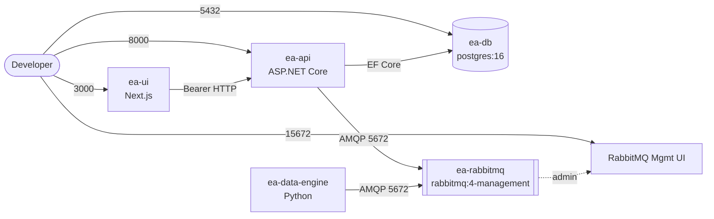

# deploy — Local Docker Compose Stack

Everything needed to run the full system on a developer workstation: UI, API, data engine, PostgreSQL, and RabbitMQ. The layout mirrors the shared application topology used by both cloud targets.

## Files

| File | Role |
|---|---|
| `compose.yaml` | Production-parity baseline using each service's real Dockerfile. |
| `compose.override.yaml` | Dev conveniences, including the Next.js development server and source mount. |

The split lets CI smoke-test the same image recipe used in production (`compose.yaml` alone), while day-to-day dev enjoys hot reload (both files merged).

## Local Topology



## Port and Credential Map

| Service | Host Port | Container Port | Credentials |
|---|---|---|---|
| UI | 3000 | 3000 | — |
| API | 8000 | 8000 | Bearer token (dev auth handler in Development) |
| Data Engine | — (no inbound) | — | — |
| RabbitMQ AMQP | 5672 | 5672 | `guest` / `guest` |
| RabbitMQ Management UI | 15672 | 15672 | `guest` / `guest` |
| PostgreSQL | 5432 | 5432 | db `postgres`, user `postgres`, password `password` |

Health checks gate startup: the API waits for `ea-db` and `ea-rabbitmq` to report healthy, and has its own `/health/live` probe.

## Common Commands

```bash
# Build and start everything (foreground, logs streamed)
docker compose -f deploy/compose.yaml up --build

# Detached
docker compose -f deploy/compose.yaml up --build -d

# Tail logs for one service
docker compose -f deploy/compose.yaml logs -f ea-api

# Reset DB and broker state (destroys volumes)
docker compose -f deploy/compose.yaml down -v

# Rebuild one service only
docker compose -f deploy/compose.yaml up --build ea-data-engine
```

Compose v2 picks up `compose.override.yaml` automatically when running from the repo root or `deploy/`.

## Volumes

| Volume | Content | Reset Command |
|---|---|---|
| `ea-db-data` | PostgreSQL data directory | `docker compose ... down -v` |
| `ea-rabbitmq-data` | RabbitMQ definitions + mnesia | `docker compose ... down -v` |
| `ui-node-modules` (override only) | Cached `node_modules` for `next dev` | `docker volume rm enterprise-app_ui-node-modules` |

## Gotchas

- **First run builds everything.** Allow a few minutes; subsequent runs hit layer cache.
- **Port 5432 conflicts** with local Postgres installs are common — stop the host service or remap the port in an override.
- **Seed data** is inserted by the API's `SeedHostedService` on startup (Development only) and is idempotent.
- **Migrations run inline locally.** In the cloud they run as a dedicated Container Apps Job; locally the API applies them on boot.
