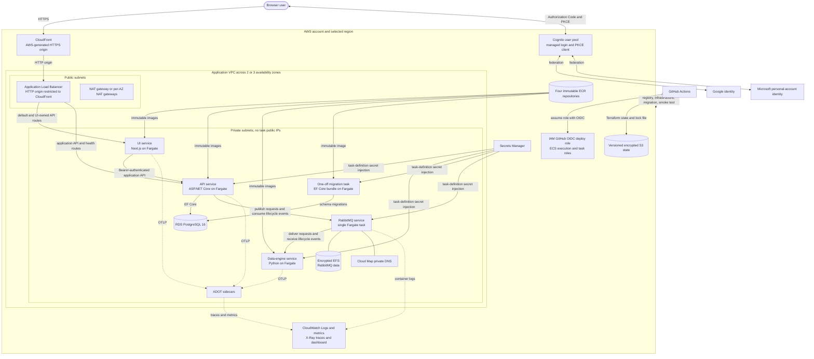

# AWS Terraform implementation

This root is the AWS peer of [`../azure/`](../azure/). It deploys the same four application images behind AWS-managed HTTPS while keeping AWS state, credentials, identity federation, networking, and operations isolated from the Azure implementation.

The public application origin is an AWS-generated CloudFront hostname. No custom domain, public Route 53 hosted zone, DNS record, or ACM certificate is created or required.

## Architecture



CloudFront forwards all methods, headers, query strings, and cookies to one ALB origin with caching disabled. The ALB sends `/api/health` and `/api/runtime-config` to Next.js, sends `/api/*`, `/health/*`, `/openapi/*`, and `/scalar/*` to the API, and sends every other path to Next.js.

## Service and resource inventory

| Service or resource | Purpose | Exposure and network | Persistence or state | Terraform owner |
|---|---|---|---|---|
| CloudFront | Canonical application HTTPS origin and viewer HTTPS redirect | Public AWS-generated hostname; proxies to the ALB over HTTP | Distribution configuration in Terraform state; application caching disabled | `modules/cloudfront` |
| Application Load Balancer | Path routing and target health checks for UI and API | Public subnets; port 80 accepts only the AWS-managed CloudFront origin-facing prefix list | Stateless; deletion protection when `environment = "prod"` | `modules/load-balancer` |
| Next.js UI | Browser shell, OIDC adapter, runtime configuration, and health route | Fargate task in private subnets without a public IP; ALB reaches port 3000 | Stateless container; immutable image in ECR | `modules/container-services` |
| ASP.NET Core API | System of record, JWT validation, EF Core access, audit records, and RabbitMQ publishing/consumption | Fargate task in private subnets without a public IP; ALB reaches port 8000 | Domain data in RDS; immutable image in ECR | `modules/container-services` |
| Python data engine | Consumes run requests, performs computations, and publishes lifecycle events | Fargate task in private subnets; no inbound public route; AMQP through the shared task security group | Stateless container; immutable image in ECR | `modules/container-services` |
| EF Core migration task | Applies database migrations before smoke testing | One-off Fargate task in private subnets; no public IP | Exit status is the deployment gate; immutable image in ECR | `modules/container-services` |
| RabbitMQ | Durable application command and lifecycle-event transport | One Fargate task in private subnets; AMQP 5672 is reachable only between tasks using the shared security group; management port 15672 is not publicly routed | `/var/lib/rabbitmq` on encrypted EFS | `modules/rabbitmq` |
| EFS | RabbitMQ data volume | Mount targets in every selected private subnet; NFS 2049 only from the ECS task security group; transit encryption enabled | Encrypted regional file system and dedicated access point | `modules/rabbitmq` |
| Cloud Map | Stable private RabbitMQ hostname | Private DNS namespace in the application VPC | Service-registration state | `modules/ecs-cluster`, `modules/rabbitmq` |
| RDS PostgreSQL 16 | Application database | Private DB subnet group; not publicly accessible; port 5432 only from the ECS task security group | Encrypted gp3 storage, storage autoscaling, automated backups, optional Multi-AZ standby, final snapshot in production | `modules/postgres` |
| Cognito | Federation broker, managed login, API resource server, and public browser client | AWS-managed public OIDC endpoints; callback/logout use the generated application origin plus localhost development URLs | User-pool and provider configuration; no application-managed local Cognito user flow | `modules/cognito` |
| Secrets Manager | Injects the PostgreSQL connection string and RabbitMQ password into task definitions | AWS API access through the ECS execution role; values are not placed in ordinary container environment blocks | Secret versions; immediate deletion in non-production and a 30-day recovery window in production | `modules/secrets-manager` |
| ECR | Stores API, UI, data-engine, and migration images | AWS registry API; deployment runner authenticates through its assumed role | Immutable tags, scan on push, AES-256 encryption, lifecycle policies | `modules/container-registry` |
| ECS cluster and services | Runs all Fargate workloads and enables ECS Exec | Tasks use private subnets, no public IPs, and one shared task security group | Service/task-definition state; Container Insights enabled | `modules/ecs-cluster`, `modules/container-services`, `modules/rabbitmq` |
| Application Auto Scaling | CPU target tracking for API, UI, and data engine | AWS control plane | Scales from `desired_count` through `maximum_desired_count` at a 70% CPU target | `modules/container-services` |
| ADOT sidecars | Receives OTLP from API, UI, and data-engine tasks | Task-local ports 4317/4318 | Exports traces to X-Ray and metrics through CloudWatch EMF; sidecars are nonessential | `modules/container-services` |
| CloudWatch and X-Ray | Logs, ECS/ALB metrics, high-CPU alarms, dashboard, and distributed traces | AWS observability APIs | Configurable log retention; dashboard and alarm definitions in Terraform | `modules/observability` plus ADOT task definitions |
| VPC, subnets, internet gateway, and NAT | Network isolation and private-workload egress | Two or three public/private subnet pairs; public default route through the internet gateway; private default routes through NAT | Network configuration | `modules/networking` |
| ECS IAM roles | Image/log/secret access at task startup, application telemetry access, and ECS Exec channels | AWS IAM control plane | Role and policy state | `modules/ecs-iam` |
| S3 Terraform backend | Separate bootstrap, development, and production state objects with native lock files | AWS API only; public access blocked | Versioning and AES-256 encryption; noncurrent versions expire after 90 days | `bootstrap` |
| GitHub Actions OIDC provider and role | Keyless CI authentication for protected GitHub Environments | Trust is restricted to this repository's `dev` and `production` environment subjects | IAM trust and deploy policy | `bootstrap` |
| AWS Budget | Monthly cost guardrail with an optional 80% actual-spend email notification | AWS Budgets API | Account-level budget configuration | `infra/scripts/aws-onboard.sh` |

Every taggable application resource receives `project`, `environment`, `managed-by = "terraform"`, and `cloud = "aws"` tags plus optional caller-supplied tags. Physical names use the project and Terraform environment prefix; development and production therefore own separate ECR repositories and application resources.

## Security and availability boundaries

- The ALB is internet-facing because CloudFront requires a reachable origin, but its security group admits HTTP only from the AWS-managed CloudFront origin-facing prefix list. The origin leg is HTTP; viewer traffic is redirected to HTTPS and uses the CloudFront default certificate.
- UI, API, data-engine, migration, and RabbitMQ tasks run in private subnets with `assign_public_ip = false`. Their internet-bound AWS and package traffic crosses NAT.
- The shared ECS task security group permits ALB-to-UI on 3000, ALB-to-API on 8000, and task-to-task AMQP on 5672. RDS and EFS have separate security groups that admit only the shared task group.
- RDS is encrypted and private. Development retains one day of automated backups; production retains seven days, enables Multi-AZ, enables deletion protection, and requires a final snapshot on destroy.
- RabbitMQ is a single ECS task backed by EFS. EFS protects broker data across task replacement, but this is not a highly available broker design. Production approval requires accepting that limitation or replacing it with a managed/HA design.
- API, UI, and data-engine ECS services use deployment circuit breakers with rollback and wait for steady state. Each scales on average CPU; RabbitMQ remains fixed at one task.
- Terraform generates the database and broker passwords. The deployed values live in Secrets Manager, but they also exist in encrypted Terraform state. Access to the state bucket is therefore secret-bearing access.
- Secret-consuming ECS task definitions receive explicit `AWSCURRENT` references whose Terraform outputs depend on the corresponding secret-version resources. The execution-role output likewise waits for its image, log, and secret-read policies, preventing fresh-environment tasks from starting against an empty secret container or an incomplete execution role.
- The bootstrap deployment policy is intentionally broad for initial account provisioning. Derive a least-privilege replacement from development CloudTrail evidence before production.

## Environment profiles

The logical GitHub Environment is `production`, while its committed Terraform file deliberately sets `environment = "prod"` for resource names and production protections.

| Setting | Development (`envs/dev.tfvars`) | Production (`envs/production.tfvars`) |
|---|---|---|
| NAT | One shared NAT gateway | One NAT gateway per selected availability zone |
| RDS size | `db.t4g.micro` | `db.t4g.small` |
| RDS availability | Single-AZ | Multi-AZ |
| RDS/ALB deletion protection | Disabled | Enabled |
| RDS deletion behavior | Final snapshot skipped | Final snapshot required |
| Secrets deletion recovery | Immediate | 30 days |
| CloudWatch log retention | 14 days | 90 days |
| Synthetic developer auth | Enabled | Disabled |
| Synthetic guest auth | Disabled | Enabled as the explicit production guest hatch |
| Continuous service count | Minimum 1, maximum 3 | Minimum 1, maximum 3 |

`image_tag = "latest"` in the tfvars files is only a local default. GitHub Actions overrides it with an immutable branch-and-commit tag for development and an immutable commit tag for production.

## Authentication

Cognito is a federation broker, not an application password store:

- The user pool permits administrator-created accounts only, and the public UI client enables Authorization Code flow with PKCE plus refresh-token auth. The deployed acceptance path exposes Google and Microsoft personal-account federation, not a native Cognito password workflow.
- The client requests `openid`, `profile`, `email`, and the application `access_as_user` scope. Access and ID tokens last 60 minutes; refresh tokens last 30 days; token revocation and user-existence-error suppression are enabled.
- Terraform registers the generated CloudFront application callback/logout URLs and the localhost development callback/logout URLs.
- The Google provider maps `sub`, `name`, and `email`. The Microsoft provider is supplied through the generic upstream OIDC input and uses the same normalized attributes. A generic SAML input also exists but is not part of the current GitHub deployment acceptance path.
- The deployment workflow fails before Terraform unless both Google and Microsoft protected credentials and the Microsoft issuer are present in the selected GitHub Environment.

Provider credentials are GitHub Environment secrets, never deploy-config or tfvars values. The only provider-side browser edit that the scripts cannot perform is adding the generated Cognito federation callback to the reused Google OAuth client. See the [AWS deployment runbook](../../docs/runbooks/aws-deployment.md) for that one-time step and the scripted Microsoft registration.

## Observability

CloudWatch log groups exist for API, UI, data engine, RabbitMQ, and migrations. API, UI, and data-engine task definitions each include a nonessential ADOT sidecar. Applications send task-local OTLP; ADOT exports traces to X-Ray and metrics through EMF under the `EnterpriseApp` namespace. RabbitMQ and migrations use the `awslogs` driver but do not have ADOT sidecars.

The operations dashboard contains ECS CPU time series for all continuously running services, ALB request and load-balancer 5xx counts, and a recent API/data-engine error query. A separate alarm for each API, UI, data-engine, and RabbitMQ service fires when average CPU exceeds 80% for two five-minute periods. Alarm notification routing is not created by this root and remains a production-readiness item.

## Bootstrap and configuration

Use short-lived IAM Identity Center credentials. The onboarding and SSO scripts reject the AWS account root identity and never require long-lived AWS access keys. Docker is intentionally unavailable inside `ea-dev-env`; GitHub-hosted runners build all deployment images.

Required authenticated CLIs are AWS CLI, GitHub CLI, Terraform, and Azure CLI for the scripted Microsoft personal-account registration. The scripts also require `git`, `jq`, `rg`, `curl`, and standard shell utilities.

Copy the tracked template to an ignored per-environment file:

```bash
cp infra/aws/envs/dev.deploy.env.example infra/aws/envs/dev.deploy.env
```

| Config key | Required | Meaning | Secret? |
|---|---|---|---|
| `AWS_PROFILE` | Yes | Non-root IAM Identity Center or assumed-role profile used by local bootstrap | No |
| `AWS_REGION` | Yes | Deployment region; must match the committed environment tfvars | No |
| `AWS_NAME_SUFFIX` | Yes | Four-to-ten-character lowercase suffix that makes the state bucket globally unique | No |
| `GITHUB_OWNER` | Yes | Repository owner used by GitHub CLI and OIDC trust | No |
| `GITHUB_REPO` | Yes | Repository name used by GitHub CLI and OIDC trust | No |
| `DEPLOYMENT_TARGETS` | Yes | Push-routing selection containing `aws` | No |
| `COGNITO_DOMAIN_PREFIX` | Yes | Globally unique lowercase Cognito managed-login prefix | No |
| `AWS_MONTHLY_BUDGET_USD` | Yes | Positive monthly budget amount | No |
| `AWS_BUDGET_EMAIL` | No | Optional email subscriber for the 80% actual-spend notification | Personal; keep only in the ignored file |
| `DEPLOY_REF` | Yes | Remote Git ref that must resolve to the same commit as clean local `HEAD` | No |
| `GITHUB_PRODUCTION_REVIEWER` | Production only | `user:<login>` or `team:<slug>` reviewer; self-review is prevented | No |

The copied `*.deploy.env` file and generated `*.tfplan` files are ignored. Never add identity-provider credentials to either file. The scripts read and write these protected GitHub Environment values directly:

| GitHub Environment variables | GitHub Environment secrets |
|---|---|
| `AWS_REGION` | `GOOGLE_OIDC_CLIENT_ID` |
| `AWS_DEPLOY_ROLE_ARN` | `GOOGLE_OIDC_CLIENT_SECRET` |
| `AWS_TFSTATE_BUCKET` | `MICROSOFT_OIDC_CLIENT_ID` |
| `COGNITO_DOMAIN_PREFIX` | `MICROSOFT_OIDC_CLIENT_SECRET` |
| `MICROSOFT_OIDC_ISSUER` | — |

The repository-level `DEPLOYMENT_TARGETS` variable controls which provider adapters run on pushes.

## First deployment

The supported first-deployment entry point owns the CLI-amenable sequence:

```bash
infra/scripts/aws-onboard.sh dev \
  --config infra/aws/envs/dev.deploy.env
```

It verifies the account, caller, region, repository, clean/pushed revision, configuration format, and required tools; reconciles the budget and AWS service-linked roles; creates/imports and applies the S3/bootstrap state; creates or reuses GitHub OIDC; configures the selected GitHub Environment; reconciles customer SSO; and saves an account-backed application plan without dispatching a deployment.

Review the saved plan, then rerun the same command with `--deploy` to dispatch the cloud-neutral workflow. Do not manually run fragments from the middle of onboarding after a failure; correct the reported condition and rerun the idempotent script.

For production, create an ignored `production.deploy.env`, set its required reviewer, run onboarding without `--deploy`, complete every workbook gate, review the saved plan, and only then rerun with `--deploy`.

## Deployment pipeline

[`deploy.yml`](../../.github/workflows/deploy.yml) selects this adapter explicitly. Non-`main` pushes deploy the `dev` GitHub Environment; `main` pushes deploy `production`; manual dispatch requires both a target and environment.

The AWS adapter performs these gates in order:

1. Validate required AWS and SSO inputs before assuming the deploy role.
2. Assume the environment-scoped IAM role through GitHub OIDC.
3. Compute the environment state key, tfvars path, and immutable image tag.
4. Initialize and validate the AWS Terraform root using S3 native locking.
5. Apply only ECR so repositories exist before image publication.
6. Build changed images; for unchanged services, copy the newest ECR manifest to the new immutable deployment tag. If no prior image exists, build it.
7. Apply the complete stack with the computed image tag and wait for ECS services to stabilize.
8. Run the migration task in the private subnets and require its container exit code to be zero.
9. Smoke-test API readiness, UI health, runtime OIDC configuration, managed login, both required federated providers, Cognito client configuration, and logout redirect behavior.
10. Discover every image used by current or draining ECS service deployments and by the migration task definition, then remove only stale ECR tags whose digests are unprotected. Cleanup always retains every tag on the newest pushed digest, the current deployment tag, `latest`, and all active tag- or digest-pinned references. A post-cleanup verifier fails the workflow if any protected reference no longer resolves; Terraform's ECR policy independently expires untagged images after seven days and caps tagged-image history at 20.

Documentation-only changes do not match the deployment workflow paths.

## Outputs

Use `terraform -chdir=infra/aws output` only after initializing the correct environment state. Do not paste account-specific output values into tracked documentation.

| Output | Consumer and purpose |
|---|---|
| `application_url` | Browser origin, Cognito callbacks/logout, UI CORS origin, and smoke tests |
| `api_url` | Normalized smoke-test API origin; on AWS it is the same CloudFront origin and relies on ALB path routing |
| `ecr_repository_urls` | AWS image build, manifest-copy, cleanup, and registry discovery scripts |
| `container_registry` | Cloud-neutral registry hostname contract |
| `load_balancer_dns_name` | CloudFront origin diagnostics; not the supported browser URL |
| `cloudfront_distribution_id` | CloudFront operations and diagnostics |
| `ecs_cluster_name` | Migration and ECS operational commands |
| `migration_task_definition_arn` | AWS migration runner |
| `migration_workload` | Cloud-neutral migration-workload contract; aliases the migration task definition |
| `private_subnet_ids` | Network configuration for the one-off migration task |
| `ecs_task_security_group_id` | Security group for the one-off migration task |
| `cognito_user_pool_id` | SSO smoke tests and Cognito diagnostics |
| `auth_authority` | Normalized OIDC issuer |
| `auth_client_id` | Public browser client and API access-token `client_id` validation |
| `auth_api_scope` | Scope requested by the UI and required by the API |
| `cloudwatch_dashboard_name` | Operator dashboard lookup |
| `aws_account_id` | Account-target confirmation; never hardcode its value |

## Validation and operations

Provider-schema validation does not require an AWS account or backend:

```bash
infra/scripts/deploy.sh validate aws dev
terraform -chdir=infra/aws/bootstrap init -backend=false
terraform -chdir=infra/aws/bootstrap validate
```

For account-backed planning and deployment, use `aws-onboard.sh`; for an ordinary already-onboarded deployment, allow push routing or explicitly dispatch `deploy.yml`. Use the [AWS deployment runbook](../../docs/runbooks/aws-deployment.md) for the exact operator procedure and the [AWS deployment workbook](../../docs/workbooks/aws-deployment-workbook.md) for verification evidence, rollback decisions, and production gates.

Do not destroy an application state casually. Development teardown requires exact account/state confirmation and a reviewed destroy plan. Production additionally requires an approved change record, retained RDS snapshot and logs, and review of the Secrets Manager recovery window.

## Module boundaries

The root owns only cross-module composition, generated database/broker passwords, common names/tags, and image URI assembly. Focused modules own provider resources:

| Module | Responsibility |
|---|---|
| `networking` | VPC, availability-zone subnet pairs, internet gateway, NAT gateways, and route tables |
| `container-registry` | Four environment-scoped ECR repositories and lifecycle policies |
| `load-balancer` | ALB, CloudFront-restricted origin security group, listeners, rules, target groups, and health checks |
| `cloudfront` | Generated HTTPS application origin and uncached ALB proxy |
| `ecs-cluster` | ECS cluster, Container Insights, Cloud Map namespace, and shared task security group |
| `postgres` | Private RDS PostgreSQL instance, subnet group, backups, and database security group |
| `cognito` | Federated user pool, API resource server, PKCE client, providers, managed domain, and branding |
| `secrets-manager` | Database connection-string and RabbitMQ-password secret versions |
| `ecs-iam` | ECS execution/task roles, restricted secret reads, telemetry writes, and ECS Exec channels |
| `observability` | Log groups, high-CPU alarms, and operations dashboard |
| `rabbitmq` | EFS, access point/mount targets, Cloud Map service, RabbitMQ task definition, and service |
| `container-services` | API/UI/data-engine task definitions and services, ADOT sidecars, scaling, and migration task definition |

The separate [`bootstrap/`](./bootstrap/) root owns only the versioned S3 backend, account-level GitHub OIDC provider when needed, and environment-scoped GitHub deployment role. It must not be merged into application state.
