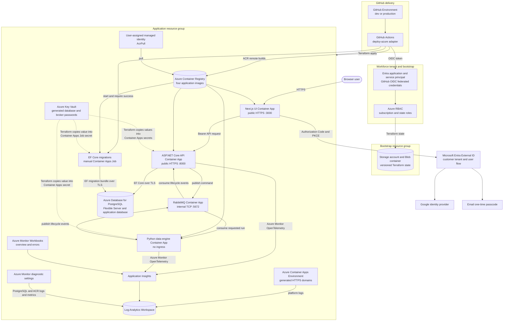

# Azure Terraform implementation

This directory is the Azure peer of [`infra/aws`](../aws/). It owns Azure-specific state, identity, runtime, data, and telemetry resources; shared deployment selection remains in [`infra/scripts/deploy.sh`](../scripts/deploy.sh). The root composes focused modules and exposes the normalized outputs consumed by the common delivery workflow.

## Architecture



The diagram deliberately distinguishes stored Key Vault secrets from runtime secret injection. The current root generates PostgreSQL and RabbitMQ passwords, stores them in Key Vault, and also passes their values into Container Apps or Job secrets during Terraform apply. The application containers do not currently resolve Key Vault references at runtime.

## Azure service inventory

| Azure service or resource | Purpose | Network / exposure | State or data role | Terraform owner |
|---|---|---|---|---|
| Resource Group | Environment boundary for the application stack | Azure control plane only | Contains the environment-scoped application resources | Root `azurerm_resource_group.this` |
| Azure Container Apps Environment | Shared execution and internal service-discovery boundary | Supplies generated domains; routes environment logs to Log Analytics | Hosts four Container Apps and the migrations job | Root `azurerm_container_app_environment.this` |
| Container App: UI | Runs the standalone Next.js server and request-time runtime configuration | Public HTTPS ingress, port 3000, insecure HTTP disabled; one to three replicas | Stateless presentation tier | `modules/container-apps` |
| Container App: API | Runs the ASP.NET Core system of record, authentication, REST API, and lifecycle consumers | Public HTTPS ingress, port 8000, insecure HTTP disabled; one to three replicas; health probes on `/health/*` | Reads and writes PostgreSQL; publishes and consumes RabbitMQ messages | `modules/container-apps` |
| Container App: data engine | Runs the stateless Python computation worker | No ingress; one replica; connects to RabbitMQ inside the Container Apps environment | Consumes requested runs and publishes started/completed/failed events | `modules/container-apps` |
| Container App: RabbitMQ | Runs RabbitMQ 4 with its management image | Internal-only TCP ingress on port 5672; management port is not published; one replica | Broker state is container-local; no Azure persistent volume is attached in the current module | `modules/container-apps` |
| Container Apps Job: migrations | Runs the EF Core migration bundle before smoke tests | No public ingress; manually triggered; one-at-a-time completion with a 600-second timeout | Mutates the PostgreSQL schema | `modules/container-apps` |
| Azure Container Registry | Stores `ea-api`, `ea-migrations`, `ea-data-engine`, and `ea-ui` images | Azure-managed registry endpoint; admin credentials disabled | Environment-scoped deployment images; retention is enforced by CI scripts | `modules/container-registry` |
| User-assigned managed identity | Authenticates application image pulls | No endpoint | Carries `AcrPull` on the environment registry; attached to UI, API, worker, and migration job | Root identity and role assignment |
| Azure Database for PostgreSQL Flexible Server | PostgreSQL 16 system of record plus the application database | Public access enabled; firewall permits Azure services through the `0.0.0.0` Azure-services rule; TLS connection string | Persistent models, runs, metrics, and audit data; seven-day backup retention; no HA configured | `modules/postgres` |
| Azure Key Vault | Stores generated PostgreSQL and RabbitMQ passwords | Public network access enabled; network ACL default is currently `Allow` with Azure-services bypass | Secret copy retained independently of Container Apps secret values; RBAC authorization and seven-day soft-delete | `modules/key-vault` plus root secret resources |
| Microsoft Entra External ID | Hosts the customer identity tenant and user flow | Microsoft-hosted OIDC endpoints | Customer identities and federation configuration; the tenant and user flow/IdPs require one-time portal setup | Tenant/user flow out of band; app registrations in `modules/entra-external-id` |
| Entra API application and service principal | Defines the API audience and `access_as_user` delegated scope | Entra control plane and OIDC token issuance | Stable application identity and authorization contract | `modules/entra-external-id` |
| Entra SPA application and service principal | Public browser client for Authorization Code + PKCE | Redirects to the generated UI origin and localhost callbacks | Client registration and API preauthorization; implicit grant disabled | `modules/entra-external-id` |
| Google federation and Email OTP | Customer sign-in methods attached to the External ID user flow | Provider-hosted authentication; no application ingress | Provider registration and user-flow policy | One-time portal setup documented in the SSO runbook |
| Application Insights | Azure Monitor application telemetry sink | Azure ingestion endpoint; connection string injected as a Container Apps secret | API and worker traces/metrics/log correlation | `modules/observability` |
| Log Analytics Workspace | Central Azure log workspace | Azure control plane/query surface | Container Apps environment logs, Application Insights data, PostgreSQL diagnostics, and ACR diagnostics | `modules/observability` |
| Azure Monitor Workbooks | Operator dashboards for overview and errors | Azure Portal | Query-only visualization over Application Insights | `modules/observability/workbooks` |
| Azure Monitor diagnostic settings | Routes platform diagnostics | No application endpoint | PostgreSQL logs/sessions/all metrics and ACR login/repository/all metrics to Log Analytics | `modules/diagnostics` |
| Azure Storage Account and Blob container | Remote Terraform backend | Public Azure Storage endpoint authenticated with Entra ID; container is private | Versioned `dev.tfstate` and `production.tfstate` with delete retention | `bootstrap/` |
| Workforce Entra application and service principal | Lets GitHub Actions authenticate without a client secret | GitHub OIDC federation into the workforce tenant | CI identity only; no application/customer data | `bootstrap/` |
| Azure RBAC assignments | Authorize CI deployment, state access, secret writes, and image pulls | Azure control plane | Access policy, not application data | `bootstrap/`, root, and `modules/key-vault` |

There is no application VNet, private endpoint, NAT gateway, Azure Front Door, Application Gateway, Static Web App, Service Bus, or managed RabbitMQ service in this root. UI and API use separate Azure-generated public HTTPS origins. PostgreSQL and Key Vault currently use public endpoints with the restrictions shown above.

## Root and module boundaries

| Path | Responsibility |
|---|---|
| `main.tf`, `locals.tf`, `variables.tf`, `outputs.tf` | Resource group, composition, shared environment/identity, generated credentials, cross-module wiring, and normalized outputs |
| `modules/container-apps` | UI, API, data engine, RabbitMQ, and migration job definitions |
| `modules/container-registry` | ACR |
| `modules/postgres` | Flexible Server, database, and Azure-services firewall rule |
| `modules/key-vault` | Vault and RBAC; root owns the secret values |
| `modules/entra-external-id` | API/SPA registrations, service principals, scope, and preauthorization in the External ID tenant |
| `modules/observability` | Log Analytics, Application Insights, and workbooks |
| `modules/diagnostics` | PostgreSQL and ACR diagnostic settings |
| `bootstrap` | One-time Azure Blob backend and GitHub OIDC trust |
| `envs` | Environment sizing, region, naming, image, identity, and feature-flag inputs |

## Prerequisites and one-time setup

1. Bootstrap the remote backend and GitHub OIDC identity with [`bootstrap/README.md`](./bootstrap/README.md).
2. Complete the External ID tenant and customer federation procedure in the [Azure SSO runbook](../../docs/runbooks/azure-sso-manual-bootstrap.md). The unavoidable browser work is tenant creation, Graph admin consent, and External ID user-flow/identity-provider configuration.
3. Keep deployment credentials in the logical `dev` and `production` GitHub Environments. Do not put tenant, subscription, application, or generated deployment identifiers into documentation, shell scripts, or populated templates committed to the repository.

## Validate and deploy

Use the cloud-neutral adapter for local validation or an explicitly authenticated plan:

```bash
cd /workspace
infra/scripts/deploy.sh validate azure dev
infra/scripts/deploy.sh plan azure dev
```

The supported application deployment path is [`.github/workflows/deploy.yml`](../../.github/workflows/deploy.yml), which invokes the Azure adapter only when `azure` is explicitly selected. Push routing is branch based: a non-`main` push targets `dev`; a `main` push targets `production`. Documentation-only changes do not trigger deployment.

The Azure adapter performs these phases:

1. Authenticate to Azure through GitHub OIDC and initialize the selected Blob state key.
2. Apply the resource group and ACR first.
3. Build and push the four images through ACR with one immutable source-derived tag.
4. Apply the full stack.
5. Start the migration job and require successful completion.
6. Smoke-test API readiness, UI health, runtime configuration, and managed login.
7. Enforce registry image retention.

Do not build deployment images inside `ea-dev-env`; it intentionally has no Docker daemon. The Azure workflow uses ACR remote builds.

## Output contract

The root exports the provider-neutral values used by shared automation:

| Output | Meaning |
|---|---|
| `application_url` | Generated public UI HTTPS origin |
| `api_url` | Generated public API HTTPS origin |
| `container_registry` | ACR login server |
| `migration_workload` | Container Apps migration job name |
| `auth_authority` | External ID OIDC v2 authority |
| `auth_client_id` | Public browser application client identifier |
| `auth_api_scope` | Fully qualified delegated API scope |

Provider-specific outputs include resource names needed by Azure CLI operations, PostgreSQL coordinates, UI/API/data-engine app names, and the sensitive Application Insights connection string. Inspect output names with `terraform -chdir=infra/azure output`; do not paste populated outputs into issues, documentation, or public workflow artifacts.

## Operations and recovery

- [Azure observability](../../docs/runbooks/azure-observability.md) covers Application Insights, Log Analytics, workbooks, RabbitMQ inspection, and PostgreSQL queries.
- [Azure SSO bootstrap](../../docs/runbooks/azure-sso-manual-bootstrap.md) covers the one-time customer-identity setup and rotation procedure.
- [Azure teardown and redeploy](../../docs/runbooks/azure-teardown-redeploy.md) contains the provider-specific safety boundary. Never use a blanket resource-group delete or unreviewed full destroy when External ID resources must be preserved.
- [`infra/README.md`](../README.md) documents the normalized multi-cloud contract and provider selection.

Tracked Azure configuration moved from the former root into `infra/azure/`. Existing state remains valid only when the new working directory is initialized against the original backend key. The root `moved` blocks preserve the Container Apps environment, application identity, and ACR pull assignment addresses; always review the plan for unexpected replacement before applying.
