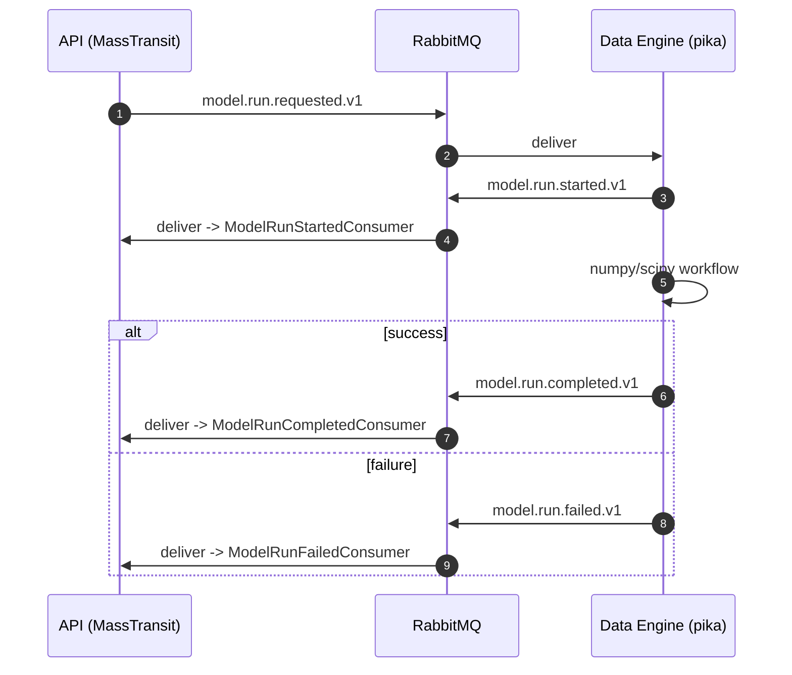

# Message Schemas

JSON Schema (Draft 2020-12) contracts for every RabbitMQ message exchanged between the .NET API (MassTransit publisher/consumer) and the Python data-engine (pika consumer/producer). **These files are the source of truth.** The .NET records in `api/src/EA.Contracts/Messages/` and the Pydantic models in `data-engine/src/data_engine/models/messages.py` mirror them and must stay in lockstep.

Logical contract names—and their `.vN` suffixes—follow `{domain}.{entity}.{action}.{version}` (see `AGENTS.md` › Messaging Contracts). The current transport uses MassTransit CLR-type fanout exchange names and queue bindings; `data-engine/src/data_engine/topology.py` maps those transport names to these versioned contracts.

## Envelope conventions

Every message — regardless of type — carries these three fields at the top level:

| Field | Type | Format | Purpose |
|---|---|---|---|
| `messageId` | string | UUID | Unique identifier for this message instance. Consumers can use it to implement deduplication. |
| `correlationId` | string | UUID | Workflow correlation. Every message in the lifecycle of a single model run shares the same value. |
| `occurredAtUtc` | string | ISO 8601 date-time | Producer-side event timestamp in UTC. |

All schemas set `additionalProperties: false` at the envelope level — unknown fields are rejected.

## Message catalog

| Schema file | Logical contract | Publisher | Consumer | Purpose |
|---|---|---|---|---|
| `model-run-requested.v1.schema.json` | `model.run.requested.v1` | API (`ModelFacade` via `IPublishEndpoint`) | Data-engine (`model_run_consumer.py`) | Kick off a new model run. Carries `modelId`, `modelRunId`, `modelName`, and free-form `parameters`. |
| `model-run-started.v1.schema.json` | `model.run.started.v1` | Data-engine (`model_run_producer.py`) | API (`ModelRunStartedConsumer`) | Ack that the data-engine has picked the run up and begun computation. |
| `model-run-completed.v1.schema.json` | `model.run.completed.v1` | Data-engine (`model_run_producer.py`) | API (`ModelRunCompletedConsumer`) | Terminal success. Carries `metrics` (name/value pairs), optional `resultSummary`, and optional pre-computed `histogramData`. |
| `model-run-failed.v1.schema.json` | `model.run.failed.v1` | Data-engine (`model_run_producer.py`) | API (`ModelRunFailedConsumer`) | Terminal failure. Carries `errorMessage` (max 4000 chars). |

Exchange/queue topology (MassTransit fanout exchanges plus per-consumer queues) is defined in `data-engine/src/data_engine/topology.py` and the API's `Program.cs` `ReceiveEndpoint` calls; the two must be kept in sync. The dotted contract names shown above are not AMQP routing-key bindings in the current implementation.

## Lifecycle

All four messages for a run share the request's `correlationId`. It is distinct from `modelRunId` and links the lifecycle across both services.

## Versioning policy

- Logical contracts are versioned with a trailing `.vN` (for example, `model.run.requested.v1`). The schema filename carries the same suffix.
- **Compatible changes** stay within the current version. Relaxing a constraint can be compatible; a new top-level property is not compatible with strict validators while `additionalProperties: false` is in force. Update the schema, the .NET record, and the Pydantic model together.
- **Breaking changes** bump the version (`.v2`) and are introduced as a new schema file alongside the old one. Both sides must accept both versions during migration; retire the old contract and exchange binding only after all producers have cut over.
- `additionalProperties: false` is enforced on envelopes. Consumers that need to tolerate forward-compatible fields should migrate to a new version rather than relaxing the schema in place.

## Adding a new schema

1. Run the `add-message-contract` skill (see `CLAUDE.md` › Skills and `.claude/skills/add-message-contract/`). It scaffolds the JSON Schema file, the `EA.Contracts` record, and a MassTransit consumer stub.
2. Add the corresponding Pydantic model to `data-engine/src/data_engine/models/messages.py` and wire producer/consumer topology in `data-engine/src/data_engine/topology.py`.
3. Add a schema-round-trip test on both sides so the JSON Schema, .NET record, and Pydantic model cannot silently drift.
